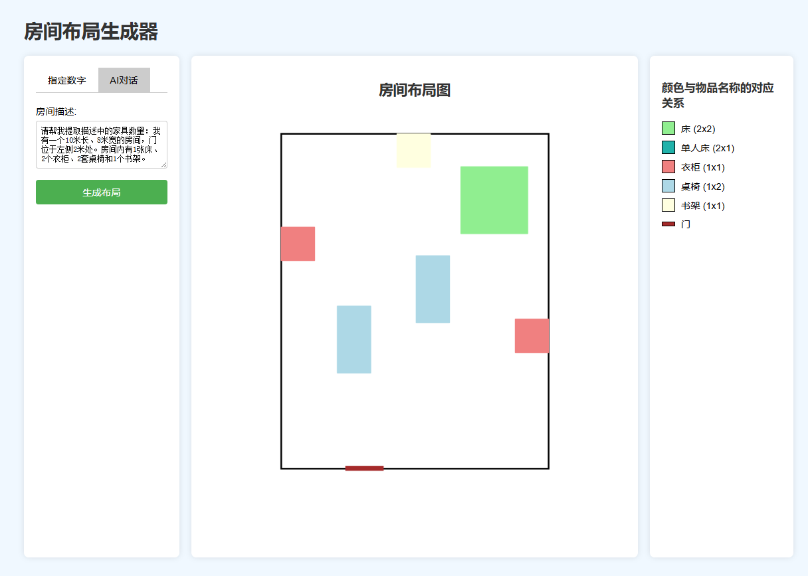
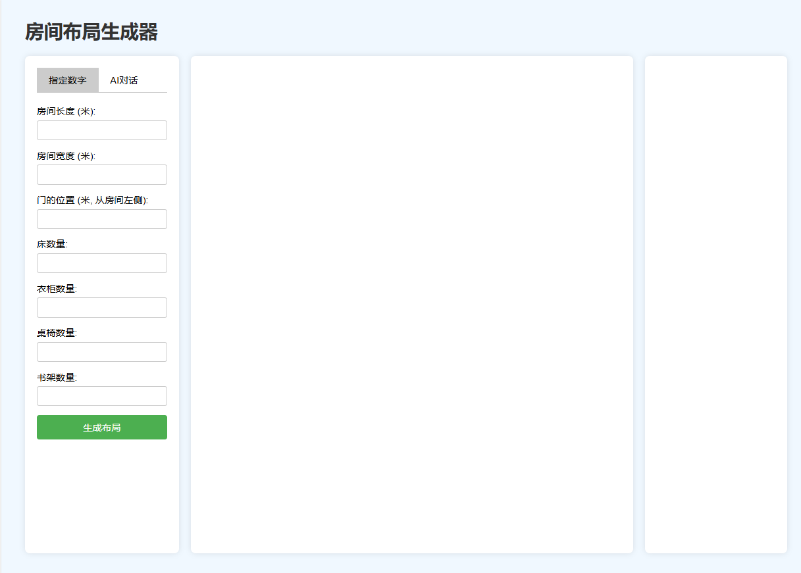
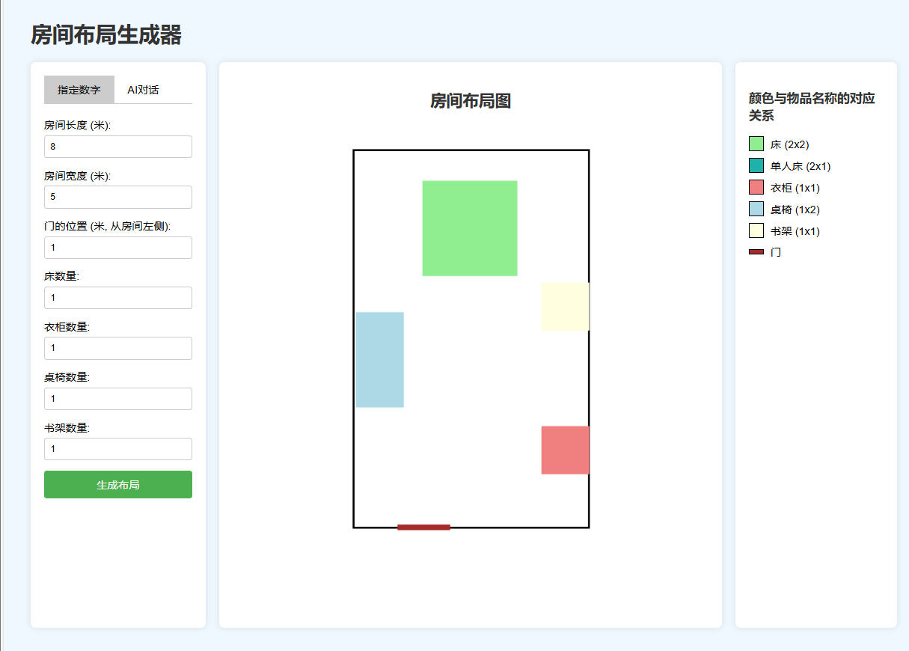
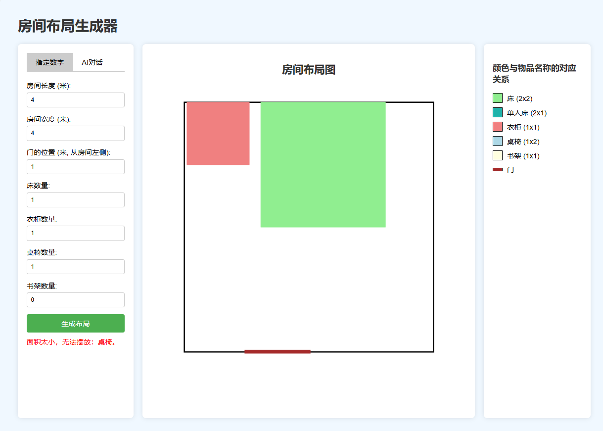

# 房间布局生成器 (Room Layout Generator)

## 项目简介

房间布局生成器是一个基于 Flask 的 Web 应用，旨在帮助用户根据输入的房间描述或直接指定数字参数，自动生成房间内家具的布局图。用户可以通过两种方式输入信息：

1. **指定数字**：手动输入房间的长度、宽度、门的位置以及各类家具的数量。
2. **AI对话**：输入自然语言描述，系统通过与 Coze API 交互，自动提取必要的参数并生成布局图。

生成的布局图将直观地展示房间内家具的摆放情况，帮助用户更好地规划和优化空间利用。

项目运行示例：



## 主要功能

- **双标签输入方式**：用户可以在“指定数字”和“AI对话”两个标签之间切换，选择适合自己的输入方式。
- **自动生成布局图**：根据输入的参数或AI提取的数据，自动绘制房间布局图。
- **错误处理**：系统会检测并提示用户输入的合理性，如门的位置是否合理，房间是否过小等。
- **直观的前端界面**：简洁美观的用户界面，易于操作和理解。

## 项目结构

```
my-coze-flask-app/
├── .env
├── .gitignore
├── requirements.txt
├── app.py
├── config.py
├── layout.py
├── chat.py
└── templates/
    └── index.html
```

- **`.env`**：存储敏感的配置信息（如 API 密钥）。
- **`.gitignore`**：确保敏感信息不会被提交到版本控制系统。
- **`requirements.txt`**：列出所有需要安装的 Python 包。
- **`app.py`**：主 Flask 应用文件，包含后端逻辑和前端模板。

## 安装与配置

### 1. 克隆项目

首先，克隆本项目到你的本地机器：

```bash
git clone https://github.com/Rise0821/Room-Layout-Generator.git
cd Room-Layout-Generator
```

### 2. 创建并激活虚拟环境（推荐）

使用 `venv` 创建一个虚拟环境：

```bash
# 创建虚拟环境
python -m venv coze-flask-env

# 激活虚拟环境
# Windows
coze-flask-env\Scripts\activate

# macOS/Linux
source coze-flask-env/bin/activate
```

### 3. 安装依赖

确保你已经创建并激活了虚拟环境，然后运行以下命令安装所有依赖包：

```bash
pip install -r requirements.txt
```

### 4. 配置环境变量

在项目根目录下创建一个名为 `.env` 的文件，并添加以下内容：

```dotenv
COZE_API_BASE=https://api.coze.com  # 替换为实际的 API 基础 URL
COZE_API_KEY=pat_kMAW937OOnErHiqO*******************OwF20gzaJF
BOT_ID=74********67347
USER_ID=123
CONVERSATION_ID=745593******21388
STREAMING=False
```

**注意**：

- **COZE_API_BASE**：Coze API 的基础 URL，请根据实际情况替换。
- **COZE_API_KEY**：你的 Coze API 密钥。
- **BOT_ID**、**USER_ID**、**CONVERSATION_ID**：根据 Coze 平台的配置填写。
- **STREAMING**：是否启用流式响应，`True` 或 `False`。

### 5. 更新 `.gitignore` 文件

确保 `.env` 文件不会被提交到版本控制系统。在项目根目录下创建或编辑 `.gitignore` 文件，添加以下内容：

```gitignore
.env
__pycache__/
*.pyc
```

## 使用说明

### 1. 运行 Flask 应用

确保虚拟环境已激活，然后运行以下命令启动 Flask 应用：

```bash
python app.py
```

你将看到类似以下的输出：

```
 * Serving Flask app 'app' (lazy loading)
 * Environment: production
   WARNING: This is a development server. Do not use it in a production deployment.
   Use a production WSGI server instead.
 * Debug mode: on
 * Running on http://127.0.0.1:5000/ (Press CTRL+C to quit)
```

### 2. 访问应用

打开你的浏览器，访问 `http://127.0.0.1:5000/`，你将看到房间布局生成器的界面。




### 3. 使用双标签输入

#### **指定数字**

1. 点击“指定数字”标签。
2. 输入房间的长度、宽度、门的位置以及各类家具的数量。
3. 点击“生成布局”按钮。
4. 页面将显示生成的房间布局图。



5. 如果房间太小无法摆放家居则提示



#### **AI对话**

1. 点击“AI对话”标签。
2. 在文本框中输入房间描述，例如：

    ```
    我有一个10米长、8米宽的房间，门位于左侧2米处。房间内有1张床、2个衣柜、2套桌椅和1个书架。
    ```
    
3. 点击“生成布局”按钮。
4. 系统将通过 Coze API 处理描述，生成 JSON 数据，并根据数据生成房间布局图。


### 4. 查看结果

生成的布局图将在页面中央显示，右侧显示颜色与家具名称的对应关系，帮助你更好地理解布局图中的元素。

## 依赖包

以下是项目中使用的所有 Python 包及其版本要求：

- **Flask**：用于构建 Web 应用。
- **matplotlib**：用于生成房间布局图。
- **python-dotenv**：用于加载环境变量。
- **langchain**：用于与大型语言模型交互。
- **langchain-community**：包含社区贡献的模块，如 `ChatCoze`。
- **requests**：用于发送 HTTP 请求。

这些依赖已经列在 `requirements.txt` 文件中，你可以通过以下命令安装：

```bash
pip install -r requirements.txt
```

### `requirements.txt` 示例

```plaintext
Flask>=2.0.0
matplotlib>=3.0.0
python-dotenv>=0.19.0
langchain>=0.0.50
langchain-community>=0.0.10
requests>=2.25.1
```

## 代码说明

### `app.py`

这是项目的主 Flask 应用文件，包含以下主要部分：

- **环境变量加载**：使用 `python-dotenv` 加载 `.env` 文件中的环境变量。
- **家具尺寸和颜色定义**：定义不同家具的尺寸和显示颜色。
- **布局生成逻辑**：根据输入的参数或AI提取的数据，自动放置家具，避免重叠并绘制布局图。
- **前端模板**：使用 Flask 的 `render_template_string` 渲染 HTML 模板，包含双标签表单和布局图展示。
- **表单处理**：根据表单的 `form_type` 字段，区分是“指定数字”表单还是“AI对话”表单，并调用相应的处理逻辑。

### 主要函数

- **`check_overlap`**：检查新放置的家具是否与已放置的家具重叠。
- **`generate_room_layout`**：根据房间尺寸、门的位置和家具数量，生成房间布局图并返回图像的 Base64 编码。

### HTML模板

模板使用简单的CSS和JavaScript实现了双标签切换功能，并展示生成的布局图和家具对应关系。

## 许可证

[MIT](LICENSE)

## 致谢

感谢 [Coze](https://www.coze.com) 提供的 API 支持，以及所有为 `langchain` 和 `matplotlib` 做出贡献的开发者们。

